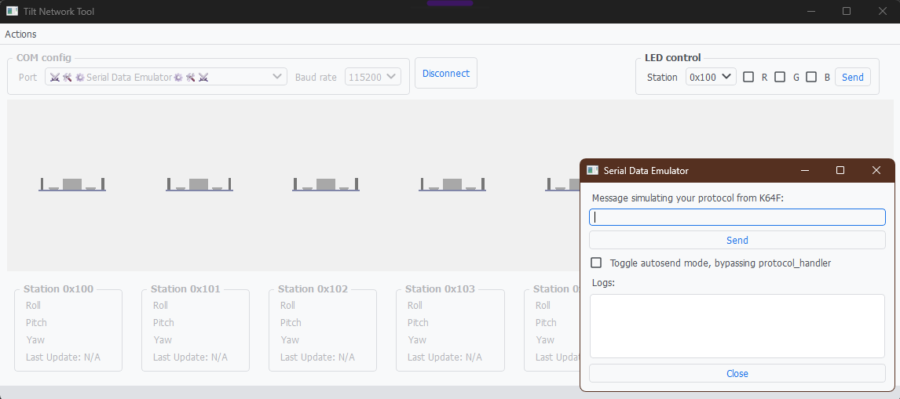
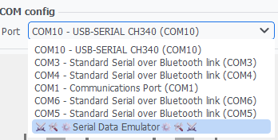
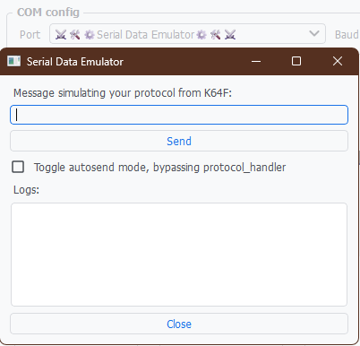

# TiltNetworkTool
Esta es una herramienta de apoyo para el curso 25.27 – Sistemas Embebidos del ITBA (Carrera de Ingeniería Electrónica), para el trabajo práctico de comunicación serie, donde múltiples estaciones basadas en FRDM-K64F reportan su inclinación utilizando sus acelerómetros, a través de un bus CAN compartido. Ya cuenta con su parte gráfica resuelta, dejando para su libre implementación el protocolo serie a usar para-con el K64F.

> Diseñado originalmente por el Ing. Juan Francisco Sbruzzi durante su transcurso por el curso en Q2-2023.

## Getting started

En el directorio el proyecto, crear entorno virtual

```bash
python -m venv venv
```

Activar el entorno virtual:

- En Windows:
    ```bash
    venv\Scripts\activate
    ```
- En Linux/Mac:
    ```bash
    source venv/bin/activate
    ```

Instalar dependencias

```bash
pip install -r requirements.txt
```

Ejecutar la aplicación

```bash
python main.py
```



## What to do

Implementar los métodos `on_bytes` y `build_led_command` de la clase `ProtocolHandler` (`src/protocol/protocol_handler.py`), en consistencia con el protocolo diseñado para-con el K64F.

> Leer con detenimiento el docstring de los métodos para comprender qué reciben y qué deben devolver.

La aplicación contiene diversos prints/logs que reportan información útil del funcionamiento interno. Se puede ajustar el nivel de reporte; ver `python main.py -h` y/o `src/app.py`

### Serial configuration

La aplicación utiliza los siguientes parámetros de comunicación serial por defecto:

- **Baudrate:** 115200
- **Formato:** 8N1 (8 bits de datos, sin paridad, 1 bit de stop)

Desde la GUI se puede seleccionar el baudrate entre las siguientes opciones: 2400, 4800, 9600, 19200, 38400, 57600 y 115200 (predeterminado).

### Serial Data Emulator

La aplicación cuenta con un emulador de puerto serie, que permite probar la aplicación sin tener un dispositivo real conectado y enviando comandos por el puerto. La misma permite enviar mensajes personalizados como si viniesen de un dispositivo externo, permitiendo interactuar con el método `on_bytes` de manera controlada. También, cuenta con un modo automático para enviar directamente datos dummy a la GUI, bypasseando `protocol_handler`, pudiendo visualizar las estaciones en movimiento.



